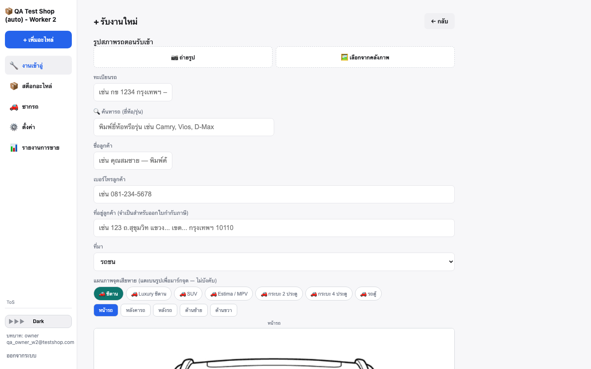
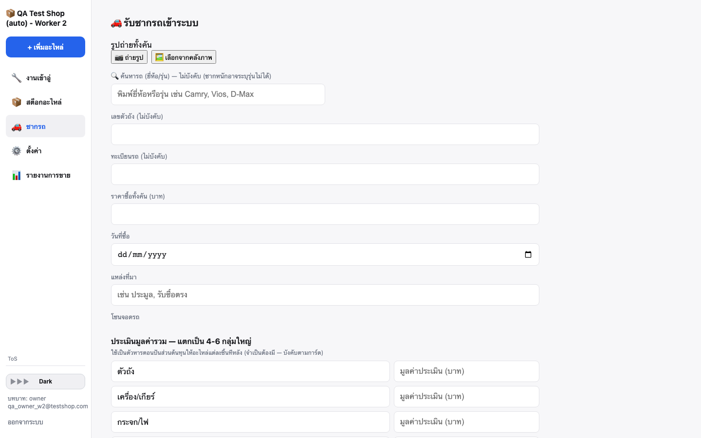
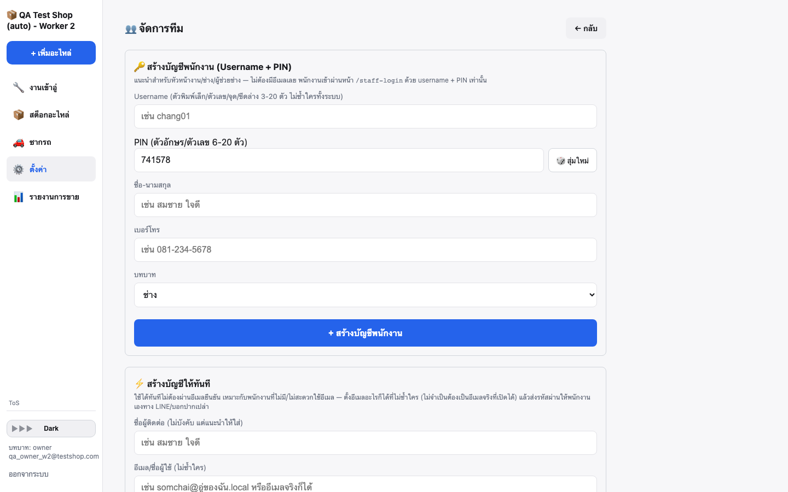
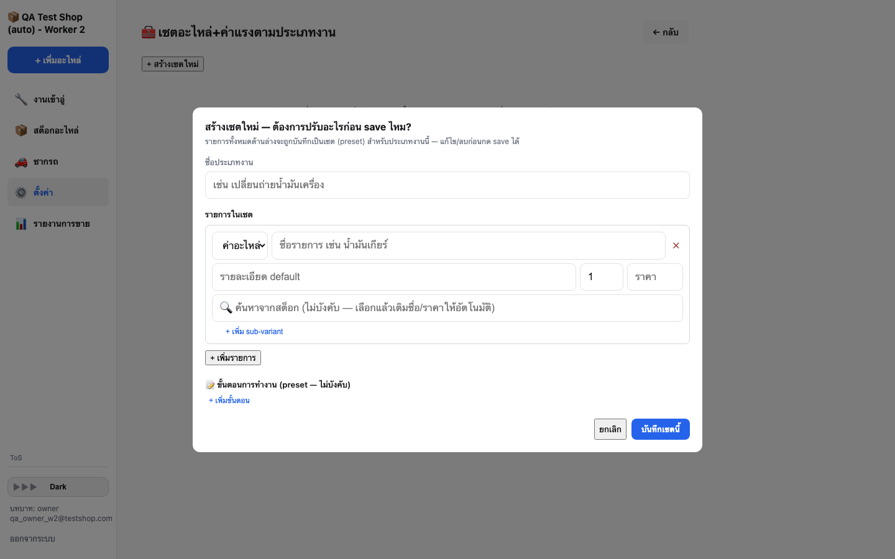
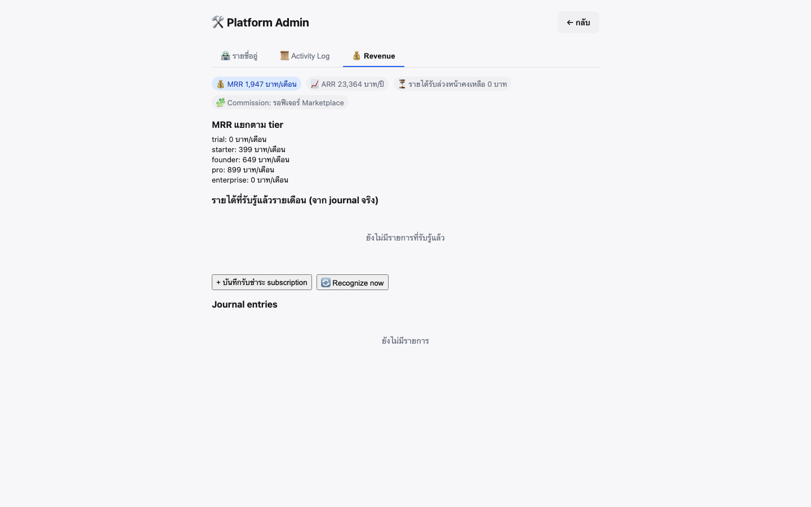
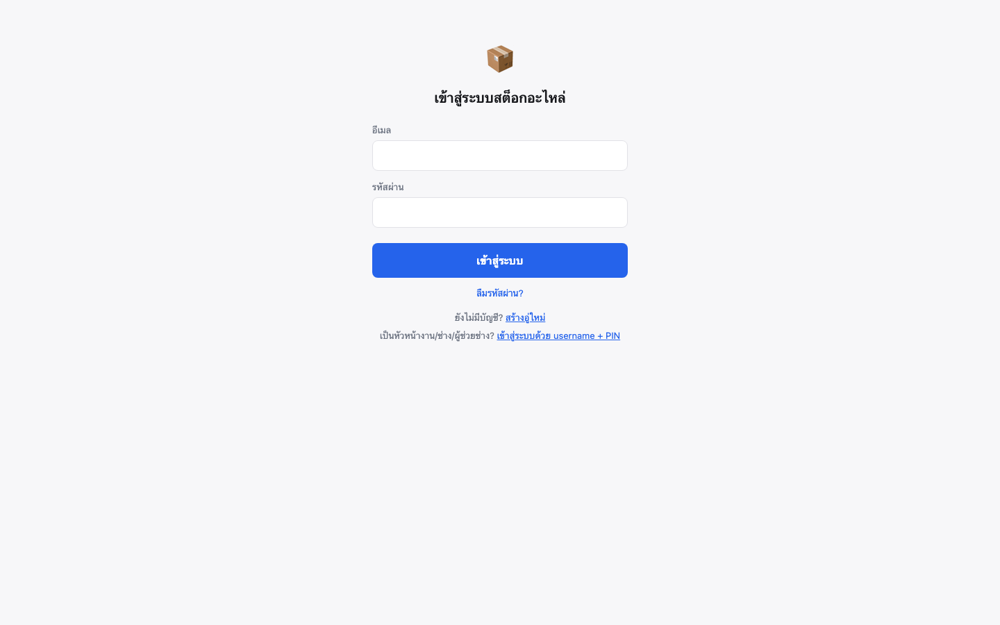

# Parts Inventory System — Pitch Deck

> อัปเดตล่าสุด 24 ก.ค. 2026 — สร้างจากการตรวจสอบโค้ด/ฟีเจอร์จริงบน staging (ไม่ใช่ roadmap เพ้อฝัน)
> screenshot ทั้งหมดถ่ายจากระบบจริงที่ `https://parts-inventory-staging.vercel.app` (บัญชีทดสอบ)

---

## 1. ปัญหา

อู่ซ่อมรถและร้านอะไหล่มือสอง/ซากรถส่วนใหญ่ในไทยยังจัดการสต็อกด้วย **สมุด/Excel/ความจำหัวหน้าช่าง**:

- หาอะไหล่ในสต็อกไม่เจอ ทั้งที่มีของจริงอยู่ในร้าน (ไม่รู้ว่าเก็บไว้ตรงไหน)
- ไม่รู้ต้นทุนที่แท้จริงของอะไหล่ถอดจากซากรถ (ซื้อทั้งคันมา แบ่งต้นทุนยังไงให้แม่นยำ)
- ไม่มีระบบสิทธิ์ที่เหมาะกับหน้างานจริง (เจ้าของ vs ช่าง vs พนักงานออฟฟิศ ต้องเห็น/ทำได้ไม่เท่ากัน)
- งานซ่อมแต่ละประเภทกรอกอะไหล่+ค่าแรงซ้ำมือทุกครั้ง ไม่มี "สูตรสำเร็จ" ให้ดึงใช้

## 2. ทางแก้

ระบบ **Multi-tenant SaaS** สำหรับอู่ซ่อมรถ/ร้านอะไหล่ — ตั้งแต่รับซากรถเข้า จนถึงขายอะไหล่ชิ้นสุดท้าย
พร้อมระบบสิทธิ์ 7 ระดับที่ตรงกับโครงสร้างองค์กรจริงของอู่ในไทย ไม่ใช่ generic role ทั่วไป

---

## 3. Feature หลัก (พร้อม screenshot จากระบบจริง)

### 3.1 หน้าสร้างงานเข้าอู่ — ค้นประวัติทะเบียน/ลูกค้าอัตโนมัติ

พิมพ์ทะเบียนรถ ระบบดึงประวัติลูกค้า/รถเดิมมาให้ทันทีถ้าเคยเข้าอู่มาก่อน ไม่ต้องกรอกซ้ำ
ผูกกับฐานข้อมูลยี่ห้อ/รุ่น/generation จริง กันข้อมูลเพี้ยนจากการพิมพ์เอง

### 3.2 ซื้อซากรถทั้งคัน → ถอดขายเป็นชิ้น (Salvage Vehicle) — ฟีเจอร์ที่คู่แข่งทั่วไปไม่มี

รับซากรถเข้าระบบ ตีมูลค่าประเมินแยกกลุ่ม แล้วระบบ**คำนวณต้นทุนต่อชิ้นให้อัตโนมัติ**ตามสัดส่วนมูลค่าประเมิน
(ราคาซื้อทั้งคัน × มูลค่าประเมินชิ้นนี้ / มูลค่าประเมินรวม) — แก้ปัญหาต้นทุนอะไหล่มือสองที่ทุกร้านเดาราคากันเอง

### 3.3 จัดการทีม — รองรับพนักงานที่ไม่มีอีเมล

ช่าง/ผู้ช่วยช่างจำนวนมากไม่มีอีเมลใช้งานประจำ — ระบบสร้างบัญชีด้วย **Username + PIN** ให้แทน
เข้าหน้าคนละหน้ากับเจ้าของ/ผู้จัดการ (`/staff-login`) ลดความซับซ้อนสำหรับพนักงานหน้างาน

### 3.4 เซตอะไหล่+ค่าแรงตามประเภทงาน (Job Type Bundle Template)

พิมพ์ชื่องาน เช่น "เปลี่ยนถ่ายน้ำมันเครื่อง" ระบบดึงรายการอะไหล่+ค่าแรงที่เคยตั้งไว้มาใส่ในงานให้ทั้งชุด
พร้อม sub-variant (เช่น น้ำมันเกียร์ CVT vs WS) และ**จำราคาค่าอะไหล่ล่าสุด**ให้อัตโนมัติ — ลดเวลากรอกงานซ้ำๆ
ทุกวัน ในขณะที่ช่างเลือกได้แค่เซตที่มีอยู่จริง (กันชื่องานเพี้ยน/ซ้ำซ้อน) ต้องเจ้าของ/ผู้จัดการ/แอดมินเป็นคนสร้างเซตใหม่

### 3.5 Platform Revenue Dashboard — ระบบหลังบ้านของเจ้าของแพลตฟอร์มเอง

แยกจากข้อมูลอู่ลูกค้าโดยสิ้นเชิง (อู่ไม่มีทางเห็นได้) ดู MRR/ARR รวม+แยกตาม tier แบบเรียลไทม์
รายได้รับล่วงหน้า (deferred revenue) รับรู้อัตโนมัติทุกวันผ่าน pg_cron — พร้อม audit trail เต็มรูปแบบ

### 3.6 หน้า Login — รองรับ 2 รูปแบบบัญชีในระบบเดียว

---

## 4. ฟีเจอร์อื่นที่ใช้งานได้จริงแล้ว (ไม่มี screenshot แนบ แต่ verify กับโค้ดจริงแล้ว)

| ฟีเจอร์ | สถานะ |
|---|---|
| ระบบตะกร้า/ขายหลายชิ้นพร้อมกัน + Picking List | ✅ ใช้งานได้จริง |
| ใบเสร็จอัตโนมัติ + ใบกำกับภาษีสำหรับงานซ่อม (มาตรา 86/4) | ✅ ใช้งานได้จริง |
| โครงสร้างโซนจัดเก็บ Area → Rack → Level พร้อมสแกน QR | ✅ ใช้งานได้จริง |
| ติดตามสถานะงานซ่อมทีละขั้นตอน (ล็อกลำดับ บังคับที่ DB) | ✅ ใช้งานได้จริง |
| Admin role (สายสำนักงาน) + ระบบขออนุมัติงานเสี่ยง (Maker-Checker) | ✅ ใช้งานได้จริง (ใหม่ 23 ก.ค. 2026) |
| Platform Admin แบ่ง 3 ระดับสิทธิ์ (Super Admin/Support/Analyst) | ✅ ใช้งานได้จริง |
| ระบบ Tier/Feature Gating (Starter/Founder/Pro ปลดล็อกฟีเจอร์ต่างระดับ) | 🔜 กำลังพัฒนา ยังไม่ deploy จริง |
| Accounting Module (ปิดงวด/ผังบัญชี) | ❌ ยังไม่เริ่ม |

## 5. โมเดลธุรกิจ

**Subscription SaaS รายเดือน แบ่ง 5 tier:**

| Tier | ราคา/เดือน | หมายเหตุ |
|---|---|---|
| Trial | ฟรี | ทดลองใช้ |
| Starter | 399 บาท | ฟีเจอร์พื้นฐาน (`/admin` ตั้งค่าระบบ) |
| Founder | 649 บาท | + Gallery view, รูปหลายใบ/คลังภาพ, ประวัติแก้ไข (audit log) |
| Pro | 899 บาท | + รายงานการขาย/analytics เต็มรูป |
| Enterprise | เจรจาราคา | Multi-branch + API access (ยังไม่เปิดตัว) |

ข้อมูลจริงจาก Platform Revenue Dashboard (บัญชีทดสอบ): MRR ≈ 1,947 บาท/เดือน, ARR ≈ 23,364 บาท/ปี
(ตัวเลขจาก 15 อู่ทดสอบ — ยังไม่ใช่ยอดลูกค้าจริง ใช้เป็นตัวอย่างแสดงว่าระบบคำนวณ MRR/ARR ได้ถูกต้องแบบเรียลไทม์)

**รายได้ในอนาคต (วางโครงไว้แล้วในโค้ด ยังไม่เปิดใช้):** Commission จาก Marketplace ระหว่างอู่ (ยังไม่ออกแบบ)

## 6. Roadmap ถัดไป

1. เปิดใช้งาน Tier/Feature Gating จริง (ใกล้เสร็จ)
2. Accounting Module — ปิดงวด/ผังบัญชี (prerequisite เสร็จหมดแล้ว รอคิวสร้าง)
3. ขายอะไหล่ที่ยังไม่ตีราคา + แก้ราคาต้นทุน/ขายตอน checkout (approval flow กลางรองรับแล้ว)
4. ใบกำกับภาษีเต็มรูปสำหรับการขายอะไหล่ผ่านตะกร้า (ตอนนี้ออกได้แค่ใบเสร็จ)
5. Multi-branch support → ปลดล็อก Enterprise tier ได้เต็มรูป

---

## อ้างอิงอื่นที่เกี่ยวข้อง

- ขั้นตอนทำงานวันต่อวันโดยละเอียด: `SOP.md`
- คู่มือผู้ใช้แบบละเอียด (role ไหนทำอะไรได้): `USER_MANUAL.md`
- รายละเอียดเทคนิค (schema, migration): `README.md`
